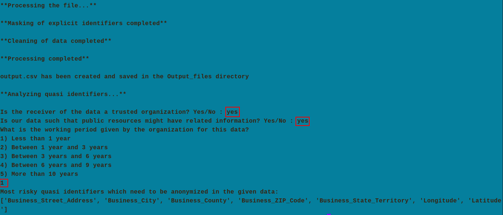

# scrub-system-for-de-identification
A scrub system for de-identification and cleaning of data  
## How to use? 
python main.py -f Input_files/records.csv -o output_file_name
 
-f, --input-file-path: Input file path
 
-o, --output-file-name: Output file name
## Demo

The above image is an illustration of the output. 
**Note:** 3 inputs are taken from the user as highlighted in the above image. Based on these inputs, the decision is formed and the output is shown. 
## Dataset used
A medical open-source dataset named "Electronic Health Record (EHR) Incentive Program Payments for Eligible Providers" taken from [here](https://catalog.data.gov/dataset/electronic-health-record-ehr-incentive-program-payments-for-eligible-providers-a4199/resource/52303c5a-ac7c-4064-9271-e960dbf69f74)
